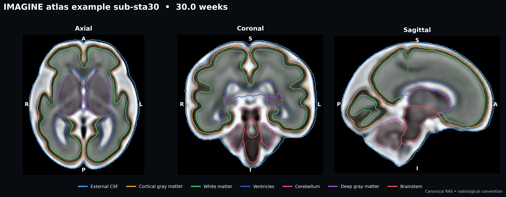
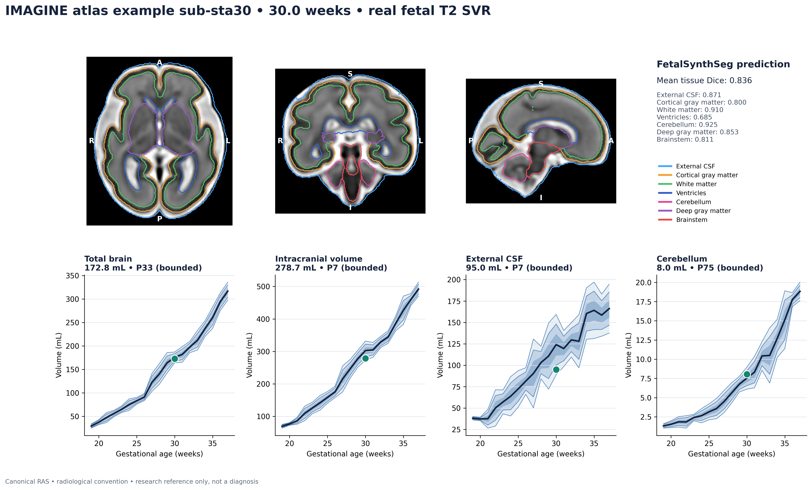

# Fetal Brain Growth

[](https://github.com/ajoshiusc/fetal-brain-growth/actions/workflows/tests.yml)
[](LICENSE)
[](#intended-use)

Standalone Python tools for fetal T2 MRI tissue segmentation, affine-aware
volumetry, transparent growth references, and presentation-quality radiology
figures. The package uses the public FetalSynthSeg implementation and its seven
FeTA tissue labels without redistributing the non-commercial checkpoint or any
clinical/controlled-access MRI.



This is a **real 30-week fetal T2 atlas image**, not a synthetic phantom. It is
the `sub-sta30` example distributed by FetalSynthSeg and originates from the CC0
[IMAGINE Fetal T2-weighted MRI Atlas](https://doi.org/10.7910/DVN/WE9JVR).
The automatic result has mean seven-tissue Dice 0.836 against the supplied
manual labels. See [real-example provenance](docs/REAL_EXAMPLE.md) and the
[per-label Dice table](docs/real_example_dice.csv).

## What is included

- a checksum-verified inference wrapper for the official FetalSynthSeg v1
  checkpoint;
- seven FeTA tissue volumes plus definition-aware literature aggregates;
- P3/P10/P25/P50/P75/P90/P97 charts reconstructed from published weekly
  summary values;
- interpolated, quadratic, cubic, and cross-validated automatic table fitting;
- direct spline/quadratic/cubic quantile regression for a local
  FetalSynthSeg-matched control cohort;
- published coefficient-only mean models from Jarvis 2016 and Ren 2022;
- canonical RAS axial/coronal/sagittal panels in radiological convention;
- 300-dpi PNG output and vector SVG/PDF support through Matplotlib;
- an executed real-data Jupyter notebook and a local ten-case FeTA gallery.


## Install

Core analysis and plotting:

```bash
git clone https://github.com/ajoshiusc/fetal-brain-growth.git
cd fetal-brain-growth
python3 -m venv .venv
source .venv/bin/activate
python -m pip install --upgrade pip
python -m pip install -e '.[notebook,test]'
pytest
```

FetalSynthSeg is public source but **not public domain**. Its software and
checkpoint license is for academic, non-commercial research. Read the upstream
[license](https://github.com/Medical-Image-Analysis-Laboratory/FetalSynthSeg/blob/main/LICENSE),
then let the installer pin the audited source commit, download the checkpoint,
and verify its SHA-256:

```bash
./scripts/install_fetalsynthseg.sh --accept-license
```

The upstream clone also supplies the real CC0 `sub-sta30` example used by the
notebook. The installer keeps `models/` and `third_party/` out of Git. For PHI
safety, `data/`, DICOM, checkpoints, and common clinical-data directories are
ignored.

## Real example: reproduce the checked-in figures

Run automatic segmentation:

```bash
fbg segment \
  --image third_party/FetalSynthSeg/data/sub-sta30/anat/sub-sta30_rec-irtk_T2w.nii.gz \
  --checkpoint models/KISPI-all_fss.ckpt \
  --output demo_outputs/real_example/sub-sta30_fetalsynthseg.nii.gz \
  --qc demo_outputs/real_example/segmentation_qc.png \
  --metadata demo_outputs/real_example/segmentation_provenance.json
```

Recreate the segmentation QC, growth chart, single-slide case report, Dice
table, volume table, scores, and provenance:

```bash
python scripts/make_real_example_figures.py \
  --image third_party/FetalSynthSeg/data/sub-sta30/anat/sub-sta30_rec-irtk_T2w.nii.gz \
  --manual-segmentation third_party/FetalSynthSeg/data/sub-sta30/anat/sub-sta30_rec-irtk_T2w_dseg.nii.gz \
  --predicted-segmentation demo_outputs/real_example/sub-sta30_fetalsynthseg.nii.gz \
  --output-dir docs
```

The automatic volumes place this example as follows. The percentile estimate is
interpolated between the available quantiles and bounded to P3–P97; it is not a
population-calibrated diagnostic probability.

| Definition-aligned measure | Volume | Bounded position | P3–P97 screen |
|---|---:|---:|---|
| Total brain | 172.8 mL | P33 | within interval |
| Intracranial volume | 278.7 mL | P7 | within interval |
| External CSF | 95.0 mL | P7 | within interval |
| Cerebellum | 8.0 mL | P75 | within interval |



## Analyze one clinical SVR case

Input should be a skull-stripped/cropped 3-D T2w SVR reconstruction. The wrapper
reproduces FetalSynthSeg preprocessing at 0.5-mm isotropic resolution, runs the
official model, and restores labels to the native image geometry.

```bash
fbg segment \
  --image /data/case001_svr.nii.gz \
  --checkpoint models/KISPI-all_fss.ckpt \
  --output outputs/case001_seg.nii.gz \
  --qc outputs/case001_segmentation_qc.png \
  --metadata outputs/case001_segmentation_provenance.json
```

Review the complete 3-D segmentation before using any volume. The QC figure
resamples the segmentation to the canonical-RAS MRI grid with nearest-neighbor
interpolation, selects the largest labeled cross-section in each plane, and
labels orientation explicitly. Patient right appears on image left in axial
and coronal panels.

For a cohort, edit [`examples/manifest.csv`](examples/manifest.csv), then run:

```bash
fbg measure --manifest examples/manifest.csv --output-dir outputs/cohort
```

NIfTI voxel volume is `abs(det(affine[0:3,0:3])) / 1000` mL; it is never
inferred from array dimensions or assumed isotropic.

## Ten real FeTA cases for a local meeting

If the FeTA 2022 BIDS release is available locally, the following command makes
a 2×5 MRI/outline overview, four-panel cohort growth chart, ten individual case
cards, volumes, research screens, and QC metadata:

```bash
fbg feta-gallery \
  --feta-root /path/to/feta_2.2 \
  --output-dir meeting_outputs/feta_10_cases
```

The default teaching set is `sub-036, sub-027, sub-034, sub-051, sub-061,
sub-005, sub-014, sub-001, sub-019, sub-050`. It deliberately includes both
FeTA phenotype groups. Dataset phenotype and a volume-reference flag are shown
as separate fields; neither is converted into an automated diagnosis. FeTA raw
data and derived meeting images remain subject to FeTA access terms and are
Git-ignored.

## Reference A: Ren 2022 weekly summaries

Build the conservative interpolated reference:

```bash
fbg build-reference \
  --method interpolate \
  --quantiles 0.03,0.10,0.25,0.50,0.75,0.90,0.97 \
  --output outputs/ren2022_curves.csv

fbg chart \
  --curves outputs/ren2022_curves.csv \
  --observations outputs/cohort/reference_compatible_volumes.csv \
  --scores outputs/cohort/reference_scores.csv \
  --regions total_brain,intracranial_volume,external_csf,cerebellum \
  --subtitle "Ren 2022 summary table; Normal-approximation centiles" \
  --output outputs/cohort/growth_chart.png
```

The spreadsheet is a double-checked transcription of Ren et al. Table 1 weekly
mean and SD values. Centiles are reconstructed as
`mean(age) + Phi_inverse(q) × SD(age)`. This is an explicit Normal approximation
to published summaries—not a refit of participant data and not centiles
published by the authors. Construction, source verification, corrections, and
label mappings are documented in [`references/README.md`](references/README.md).

Optional smoothing:

```bash
fbg build-reference --method quadratic --output outputs/ren_quadratic.csv
fbg build-reference --method cubic     --output outputs/ren_cubic.csv
fbg build-reference --method auto      --output outputs/ren_auto.csv
```

`auto` compares quadratic and cubic fits of mean and log(SD) by
leave-one-week-out error and prefers quadratic unless cubic improves the
combined normalized score by more than 5%. The JSON beside each CSV records the
selected degree, coefficients, and validation error.

## Reference B: fit the same segmentation pipeline

For individual FetalSynthSeg tissue trajectories, this is usually the better
method: process a reviewed normal control cohort with the same frozen model,
SVR pipeline, acquisition profile, and QC protocol, then directly fit quantiles.

```bash
fbg fit-reference \
  --volumes outputs/controls/tissue_volumes.csv \
  --method spline \
  --quantiles 0.03,0.10,0.25,0.50,0.75,0.90,0.97 \
  --output outputs/local_fetalsynthseg_reference.csv

fbg chart \
  --curves outputs/local_fetalsynthseg_reference.csv \
  --observations outputs/cases/tissue_volumes.csv \
  --matched-reference \
  --output outputs/local_fetalsynthseg_chart.svg
```

The default is cubic B-spline quantile regression in log-volume space.
`--method quadratic` and `--method cubic` directly fit those polynomial bases
when pre-specified. Independent fitted quantiles are pointwise ordered if they
cross, and the count is recorded in metadata. Use one scan per fetus; repeated
observations need a longitudinal or mixed-effects model.

## Reference C: published polynomial coefficients

```bash
fbg published --output outputs/published_tbv_models.png
```


Included mean equations are:

- Jarvis et al. 2016: `TBV = 89.69 − 13.33 GA + 0.53 GA²` (18–36 weeks);
- Ren et al. 2022: `TBV = 47.41 − 9.57 GA + 0.45 GA²` (19–37 weeks).

Coefficients alone do not define P3/P10/etc., so the software never invents
bands around these means. The prospective Bouachba et al. ADC Fetal & Neonatal
study can be added when an authorized coefficient/reference table is available;
this project does not reverse-engineer values from a published figure.

## Notebook

Open the executed
[`notebooks/Radiology_Meeting_Demo.ipynb`](notebooks/Radiology_Meeting_Demo.ipynb)
or standalone [`docs/Radiology_Meeting_Demo.html`](docs/Radiology_Meeting_Demo.html).
It runs FetalSynthSeg on the real 30-week image, checks it against the manual
labels, measures tissue and aggregate volumes, plots seven quantiles, and makes
the one-slide radiology case report. Run
`python scripts/build_demo_notebook.py` to reconstruct the notebook source.

## Intended use

This is research software, not a medical device. “Outside P3–P97” is a
reference flag, not an abnormality diagnosis; a within-range volume does not
exclude abnormal morphology. Gestational-age uncertainty, population sampling,
MRI acquisition, SVR reconstruction, model/domain shift, segmentation error,
and label-definition mismatch all affect interpretation. Every case requires
expert visual QC and fetal neuroradiology review. Any clinical use requires
local governance and independent validation.

## References

- Ren J-Y et al. *Front Neurosci.* 2022;16:886083.
  [doi:10.3389/fnins.2022.886083](https://doi.org/10.3389/fnins.2022.886083)
- Jarvis D et al. *Prenat Diagn.* 2016;36:1225–1232.
  [doi:10.1002/pd.4961](https://doi.org/10.1002/pd.4961)
- Zalevskyi V et al. *MICCAI.* 2024; LNCS 15001:437–447 (FetalSynthSeg).
  [doi:10.1007/978-3-031-72378-0_41](https://doi.org/10.1007/978-3-031-72378-0_41)
- Gholipour A et al. *IMAGINE Fetal T2-weighted MRI Atlas.* Harvard Dataverse,
  V1, 2023. [doi:10.7910/DVN/WE9JVR](https://doi.org/10.7910/DVN/WE9JVR)

Code in this repository is MIT licensed. The upstream FetalSynthSeg source and
checkpoint remain governed by their own license; FeTA data retain their dataset
terms.
