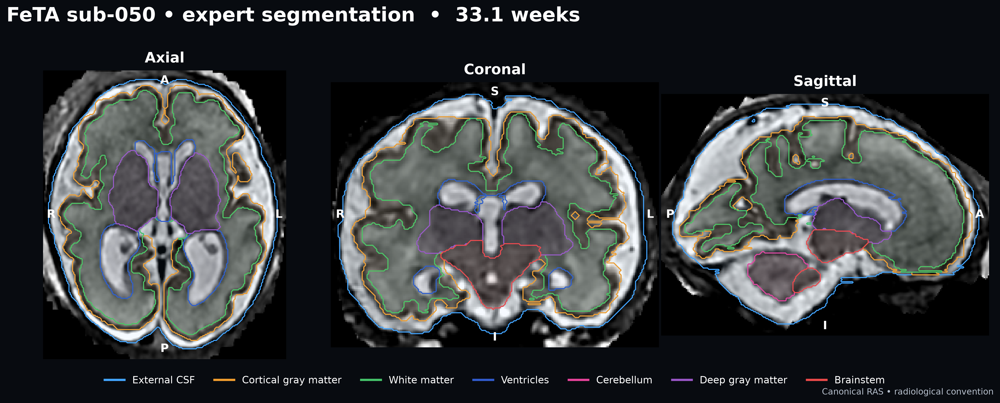
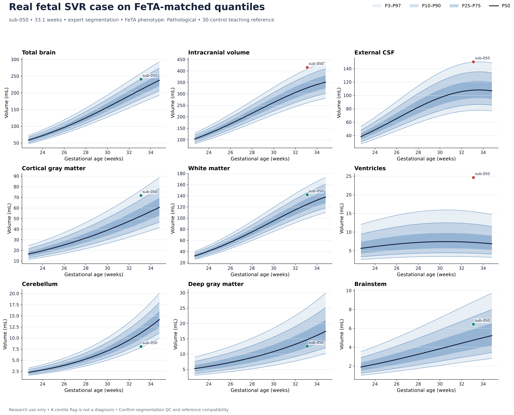
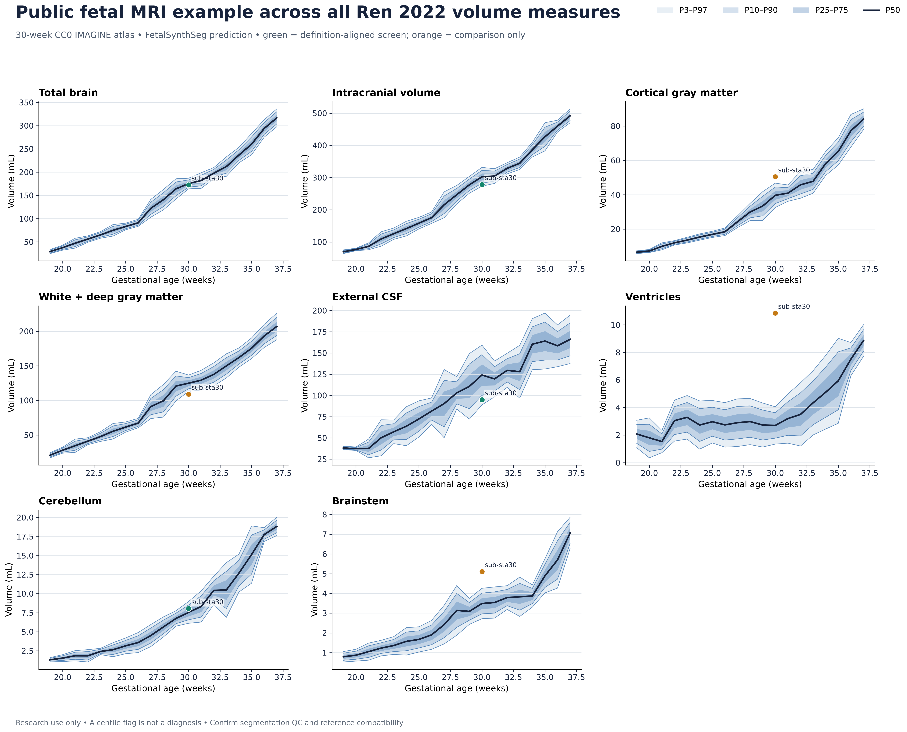
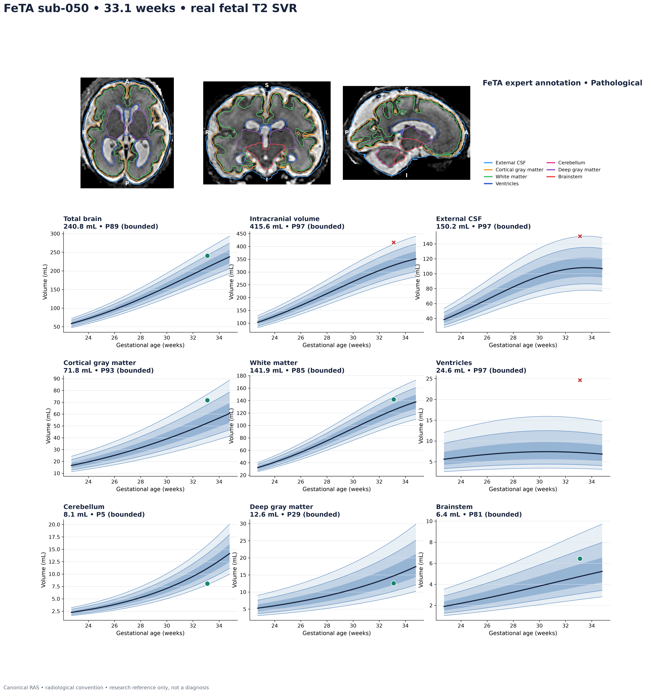
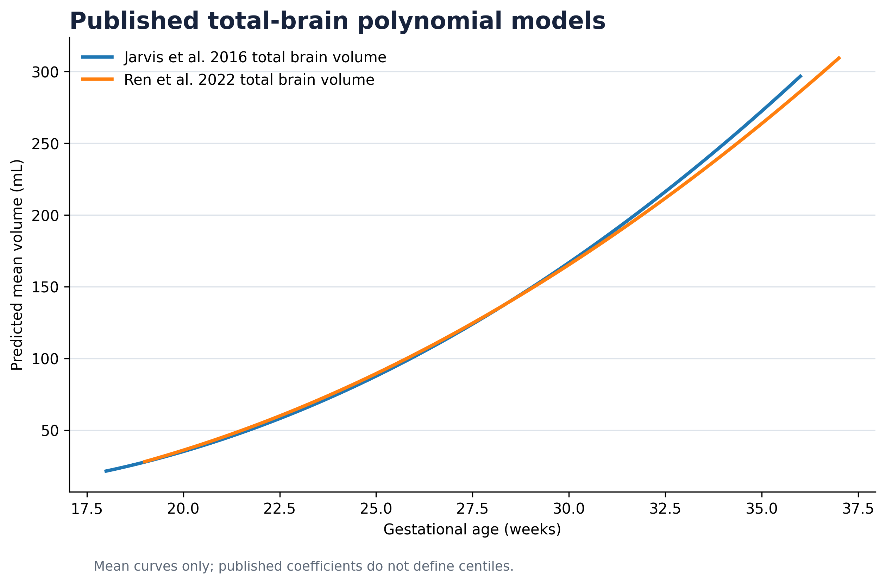

# Fetal Brain Growth

[](https://github.com/ajoshiusc/fetal-brain-growth/actions/workflows/tests.yml)
[](LICENSE)
[](#intended-use)

Standalone Python tools for fetal T2 MRI tissue segmentation, affine-aware
volumetry, transparent growth references, and presentation-quality radiology
figures. The package uses the public FetalSynthSeg implementation and its seven
FeTA tissue labels without redistributing the non-commercial checkpoint or raw
clinical NIfTI/DICOM data. Derived FeTA figures remain governed by FeTA terms.



This is a **real 33.1-week fetal T2 SVR acquisition**, not a synthetic phantom
or population atlas. It is anonymized FeTA 2.2 case `sub-050`, shown with the
dataset's expert segmentation. FeTA records its phenotype as `Pathological`;
that independent dataset field is kept separate from the volumetric reference
flags generated here. The image is included locally under FeTA terms and must
not be treated as a diagnostic exemplar.

## What is included

- a checksum-verified inference wrapper for the official FetalSynthSeg v1
  checkpoint;
- seven native FeTA tissue volumes plus total brain and intracranial volume;
- a default nine-measure reference fitted only to QC-passing FeTA 2.2 cases
  explicitly labeled `Neurotypical`;
- P3/P10/P25/P50/P75/P90/P97 charts from the primary FeTA-matched fit, plus a
  secondary reconstruction from published weekly summary values;
- interpolated, quadratic, cubic, and cross-validated automatic table fitting;
- direct spline/quadratic/cubic quantile regression for a local
  FetalSynthSeg-matched control cohort;
- published coefficient-only mean models from Jarvis 2016 and Ren 2022;
- canonical RAS axial/coronal/sagittal panels in radiological convention;
- large, presentation-readable typography with 300-dpi PNG output and vector
  SVG/PDF support through Matplotlib;
- an executed real-data Jupyter notebook and a local ten-case FeTA gallery.

## Reference hierarchy

For FetalSynthSeg outputs, use references in this order:

1. **Primary local teaching reference:** the nine-region FeTA-derived curves,
   because their label definitions exactly match FetalSynthSeg/FeTA.
2. **Preferred validation target:** a larger, independent normal cohort
   processed with the same frozen segmentation, SVR, acquisition, and QC
   pipeline, using direct quantile regression.
3. **Secondary literature comparison:** Ren 2022 summary curves. Only total
   brain, intracranial volume, external CSF, and cerebellum are sufficiently
   aligned for guarded comparison; the remaining four measures are not used
   for abnormal/normal classification.

The FeTA fit is more anatomically compatible than Ren, but its present 30-case,
partly in-sample construction is still a teaching reference—not a validated
clinical norm. Reference compatibility does not remove the need for visual
segmentation QC and neuroradiology review.

The primary figure below places the same real fetal SVR case on the
FeTA-derived quantiles.



The Ren figure is retained as a secondary compatibility-limited illustration.
Four directly aligned measures are green; four boundary-mismatched measures
are orange and explicitly comparison-only.



## Install

Core analysis and plotting:

```bash
git clone https://github.com/ajoshiusc/fetal-brain-growth.git
cd fetal-brain-growth
python3 -m venv .venv
source .venv/bin/activate
python -m pip install --upgrade pip
python -m pip install -e '.[notebook,test]'
pytest
```

FetalSynthSeg is public source but **not public domain**. Its software and
checkpoint license is for academic, non-commercial research. Read the upstream
[license](https://github.com/Medical-Image-Analysis-Laboratory/FetalSynthSeg/blob/main/LICENSE),
then let the installer pin the audited source commit, download the checkpoint,
and verify its SHA-256:

```bash
./scripts/install_fetalsynthseg.sh --accept-license
```

The upstream clone also supplies the real CC0 `sub-sta30` example used by the
notebook. The installer keeps `models/` and `third_party/` out of Git. For PHI
safety, `data/`, DICOM, checkpoints, and common clinical-data directories are
ignored.

## Public inference execution example

The repository keeps the CC0 IMAGINE atlas example only as a reproducible
automatic-inference and Dice execution check. The radiology figures featured
above and below use the real FeTA SVR case, not the atlas.

Run automatic segmentation:

```bash
fbg segment \
  --image third_party/FetalSynthSeg/data/sub-sta30/anat/sub-sta30_rec-irtk_T2w.nii.gz \
  --checkpoint models/KISPI-all_fss.ckpt \
  --output demo_outputs/real_example/sub-sta30_fetalsynthseg.nii.gz \
  --qc demo_outputs/real_example/segmentation_qc.png \
  --metadata demo_outputs/real_example/segmentation_provenance.json
```

Recreate the segmentation QC, secondary eight-panel Ren comparison, Dice
table, volume table, scores, and provenance:

```bash
python scripts/make_real_example_figures.py \
  --image third_party/FetalSynthSeg/data/sub-sta30/anat/sub-sta30_rec-irtk_T2w.nii.gz \
  --manual-segmentation third_party/FetalSynthSeg/data/sub-sta30/anat/sub-sta30_rec-irtk_T2w_dseg.nii.gz \
  --predicted-segmentation demo_outputs/real_example/sub-sta30_fetalsynthseg.nii.gz \
  --output-dir docs
```

On the secondary Ren comparison, the automatic volumes place this example as
follows. The percentile estimate is interpolated between the available
quantiles and bounded to P3–P97; it is not a population-calibrated diagnostic
probability.

| Definition-aligned measure | Volume | Bounded position | P3–P97 screen |
|---|---:|---:|---|
| Total brain | 172.8 mL | P33 | within interval |
| Intracranial volume | 278.7 mL | P7 | within interval |
| External CSF | 95.0 mL | P7 | within interval |
| Cerebellum | 8.0 mL | P75 | within interval |

The primary README report uses the real fetal SVR and all nine FeTA-matched
panels:



Regenerate these three real-SVR README figures locally with:

```bash
python scripts/make_feta_readme_figures.py \
  --feta-root /deneb_disk/feta_2022/feta_2.2 \
  --subject-id sub-050
```

This writes only derived PNG figures; it does not copy raw FeTA NIfTI data into
the repository. Keep the figures governed and distributed according to FeTA
terms.

## Analyze one clinical SVR case

Input should be a skull-stripped/cropped 3-D T2w SVR reconstruction. The wrapper
reproduces FetalSynthSeg preprocessing at 0.5-mm isotropic resolution, runs the
official model, and restores labels to the native image geometry.

```bash
fbg segment \
  --image /data/case001_svr.nii.gz \
  --checkpoint models/KISPI-all_fss.ckpt \
  --output outputs/case001_seg.nii.gz \
  --qc outputs/case001_segmentation_qc.png \
  --metadata outputs/case001_segmentation_provenance.json
```

Review the complete 3-D segmentation before using any volume. The QC figure
resamples the segmentation to the canonical-RAS MRI grid with nearest-neighbor
interpolation, selects the largest labeled cross-section in each plane, and
labels orientation explicitly. Patient right appears on image left in axial
and coronal panels.

For a cohort, edit [`examples/manifest.csv`](examples/manifest.csv), then run:

```bash
fbg measure --manifest examples/manifest.csv --output-dir outputs/cohort
```

NIfTI voxel volume is `abs(det(affine[0:3,0:3])) / 1000` mL; it is never
inferred from array dimensions or assumed isotropic.

## FeTA and FetalSynthSeg compatibility

They are directly compatible: FetalSynthSeg predicts the native FeTA label
map, so no relabeling is required.

| Value | FeTA / FetalSynthSeg structure |
|---:|---|
| 0 | background |
| 1 | external CSF |
| 2 | cortical gray matter |
| 3 | white matter |
| 4 | ventricles |
| 5 | cerebellum |
| 6 | deep gray matter |
| 7 | brainstem |

The two aggregate measures are `total_brain = 2 + 3 + 5 + 6 + 7` and
`intracranial_volume = 1 + ... + 7`. Numeric compatibility does not eliminate
model error: visually QC every FetalSynthSeg prediction before volumetry.

## Default reference: normal-appearing FeTA 2.2 brains

The exact protocol-matched default uses the locally available FeTA 2.2 expert
segmentations rather than forcing all seven labels into non-equivalent
literature definitions:

```bash
fbg feta-reference \
  --degree 2 \
  --output-dir meeting_outputs/feta_reference
```

The command automatically detects `/deneb_disk/feta_2022/feta_2.2`; elsewhere,
pass `--feta-root /path/to/feta_2.2` or set `FETA_ROOT`. It performs the
following transparent construction:

1. retain only rows whose FeTA `Pathology` field is exactly `Neurotypical`;
2. exclude technical segmentation-QC failures, but perform no volume-based
   outlier removal;
3. measure all seven native tissues, total brain, and intracranial volume from
   the NIfTI affine;
4. fit `log(volume) = polynomial(GA - mean(GA))` independently per measure;
5. estimate one residual SD in log-volume space and calculate
   `Qq(GA) = exp(fitted_log_volume(GA) + Phi_inverse(q) * residual_SD)`.

Here P50 is the fitted median. P3–P97 are estimated population intervals under
a constant log-Normal residual assumption; they are not confidence intervals
for the fitted median. Case positions are interpolated between the seven fitted
quantiles and bounded to P3–P97. Thus “P97 bounded” means P97 or higher, not an
exact tail probability.

On the currently mounted release this gives 30 QC-passing controls from 22.7 to
34.8 weeks: 31 rows are labeled neurotypical and `sub-041` is excluded because
the segmentation reaches the image boundary. The output contains
P3/P10/P25/P50/P75/P90/P97, fit coefficients, leave-one-out errors, subject
IDs, QC records, and source metadata. Quadratic is the conservative default;
`--degree 3` is an explicit sensitivity option. On these 30 controls, cubic
leave-one-out log-RMSE was no better for any measure and was up to 8.4% worse,
supporting the quadratic default. Neither degree should be extrapolated beyond
the observed age range.

This small, cross-sectional, partially in-sample reference is useful for
teaching and pipeline development, not a validated clinical norm. A larger
independent cohort processed with the same frozen pipeline remains preferable.

## Ten real FeTA cases for a local meeting

If the FeTA 2022 BIDS release is available locally, the following command makes
a 2×5 MRI/outline overview, a nine-panel cohort growth chart, ten individual
case cards with all nine matched growth panels, volumes, research screens,
fitted reference files, and QC metadata:

```bash
fbg feta-gallery \
  --output-dir meeting_outputs/feta_10_cases_matched
```

The default teaching set is `sub-036, sub-027, sub-034, sub-051, sub-061,
sub-007, sub-014, sub-001, sub-019, sub-050`. It deliberately includes both
FeTA phenotype groups. Dataset phenotype and a volume-reference flag are shown
as separate fields; neither is converted into an automated diagnosis. FeTA raw
data and derived meeting images remain subject to FeTA access terms and are
Git-ignored.

The local FeTA meeting notebook displays **both** quantile constructions for
the same ten measured cases: nine protocol-matched FeTA log-volume panels and
eight Ren weekly-mean/SD Normal-approximation panels. In the Ren chart, only
the four definition-aligned screens are green/red; definition-mismatched
measurements are orange and comparison-only. This side-by-side presentation
demonstrates reference sensitivity and must not be interpreted as longitudinal
change within a fetus.

Use `--reference ren2022` to reproduce the older four-measure literature
comparison. The matched FeTA reference is now the default because it produces
definition-compatible charts for all nine measures in both cohort and
individual-case reports.

## Secondary, compatibility-limited reference: Ren 2022 weekly summaries

Build the conservative interpolated reference:

```bash
fbg build-reference \
  --method interpolate \
  --quantiles 0.03,0.10,0.25,0.50,0.75,0.90,0.97 \
  --output outputs/ren2022_curves.csv

fbg chart \
  --curves outputs/ren2022_curves.csv \
  --observations outputs/cohort/reference_compatible_volumes.csv \
  --scores outputs/cohort/reference_scores.csv \
  --regions total_brain,intracranial_volume,external_csf,cerebellum \
  --subtitle "Ren 2022 summary table; Normal-approximation centiles" \
  --output outputs/cohort/growth_chart.png
```

The spreadsheet is a double-checked transcription of Ren et al. Table 1 weekly
mean and SD values. Centiles are reconstructed as
`mean(age) + Phi_inverse(q) × SD(age)`. This is an explicit Normal approximation
to published summaries—not a refit of participant data and not centiles
published by the authors. Construction, source verification, corrections, and
label mappings are documented in [`references/README.md`](references/README.md).

The public demo displays P3/P10/P25/P50/P75/P90/P97. With `interpolate`, mean
and SD are separately interpolated to a 0.05-week grid, so the original values
are retained at completed weeks. For example, Ren total-brain mean = 175.60 mL
and SD = 6.09 mL at 30 weeks, producing the following Normal-approximation
reference values:

| Quantile | P3 | P10 | P25 | P50 | P75 | P90 | P97 |
|---|---:|---:|---:|---:|---:|---:|---:|
| Total brain at 30 weeks (mL) | 164.1 | 167.8 | 171.5 | 175.6 | 179.7 | 183.4 | 187.1 |

For a case, the expected quantiles are interpolated at its exact gestational
age, and its displayed percentile is interpolated between adjacent quantile
values and bounded to P3–P97. Measurements below P3 or above P97 receive a
research flag only when label definitions are compatible. Total brain,
intracranial volume, external CSF, and cerebellum pass that guard; cortical gray
matter, white-plus-deep-gray, ventricles, and brainstem remain comparison-only.
These bands are estimated population reference intervals, not confidence
intervals around a mean. The demo retains Ren for transparent literature
comparison, but uses the FeTA-derived curves as its primary local reference.
The BMJ Fetal & Neonatal paper is not the active reference source.

Optional smoothing:

```bash
fbg build-reference --method quadratic --output outputs/ren_quadratic.csv
fbg build-reference --method cubic     --output outputs/ren_cubic.csv
fbg build-reference --method auto      --output outputs/ren_auto.csv
```

`auto` compares quadratic and cubic fits of mean and log(SD) by
leave-one-week-out error and prefers quadratic unless cubic improves the
combined normalized score by more than 5%. The JSON beside each CSV records the
selected degree, coefficients, and validation error.

## Larger local reference: fit the same segmentation pipeline

For individual FetalSynthSeg tissue trajectories, this is usually the better
method: process a reviewed normal control cohort with the same frozen model,
SVR pipeline, acquisition profile, and QC protocol, then directly fit quantiles.

```bash
fbg fit-reference \
  --volumes outputs/controls/tissue_volumes.csv \
  --method spline \
  --quantiles 0.03,0.10,0.25,0.50,0.75,0.90,0.97 \
  --output outputs/local_fetalsynthseg_reference.csv

fbg chart \
  --curves outputs/local_fetalsynthseg_reference.csv \
  --observations outputs/cases/tissue_volumes.csv \
  --matched-reference \
  --output outputs/local_fetalsynthseg_chart.svg
```

The default is cubic B-spline quantile regression in log-volume space.
`--method quadratic` and `--method cubic` directly fit those polynomial bases
when pre-specified. Independent fitted quantiles are pointwise ordered if they
cross, and the count is recorded in metadata. Use one scan per fetus; repeated
observations need a longitudinal or mixed-effects model.

## Published polynomial coefficients

```bash
fbg published --output outputs/published_tbv_models.png
```



Included mean equations are:

- Jarvis et al. 2016: `TBV = 89.69 − 13.33 GA + 0.53 GA²` (18–36 weeks);
- Ren et al. 2022: `TBV = 47.41 − 9.57 GA + 0.45 GA²` (19–37 weeks).

Coefficients alone do not define P3/P10/etc., so the software never invents
bands around these means. The prospective Bouachba et al. ADC Fetal & Neonatal
study can be added when an authorized coefficient/reference table is available;
this project does not reverse-engineer values from a published figure.

## Other compatible growth-chart resources

[BOUNTI](https://doi.org/10.7554/eLife.88818.1) is the strongest public
larger-cohort alternative found: its paper reports reviewed segmentations from
390 healthy controls at 21–38 weeks and P5/P50/P95 growth charts for nine
structures. The current
[Multi-BOUNTI reporting repository](https://github.com/SVRTK/perinatal-brain-mri-analysis)
also exposes polynomial reporting models. It is best used end-to-end with
BOUNTI/Multi-BOUNTI labels. It is not silently applied to FeTA maps because its
ontology separates structures that FeTA combines (for example cerebellar
vermis and ventricular compartments), and its public code is GPL-3.0 rather
than MIT.

[Kyriakopoulou et al.](https://doi.org/10.1007/s00429-016-1342-6) provide an
MRI centile resource based on 127 normal fetuses at 21–38 weeks, but its manual
biometry definitions likewise are not a drop-in seven-label FetalSynthSeg
reference. The four conservatively matched Ren comparisons therefore remain
available, while the local FeTA fit is the exact-label default.

## Notebook

For the locally mounted FeTA data, open
[`notebooks/FeTA_10_Case_Meeting.ipynb`](notebooks/FeTA_10_Case_Meeting.ipynb).
It builds or reuses the 10-case expert-segmentation gallery, displays all nine
matched charts, lists the research flags, and exposes the fit diagnostics. The
tracked notebook has no controlled-data outputs; after running it locally, use
the executed copy under `meeting_outputs/` for the meeting. Rebuild its clean
source with `python scripts/build_feta_meeting_notebook.py`.

The public, fully executed demonstration is
[`notebooks/Radiology_Meeting_Demo.ipynb`](notebooks/Radiology_Meeting_Demo.ipynb)
or standalone [`docs/Radiology_Meeting_Demo.html`](docs/Radiology_Meeting_Demo.html).
It creates or reuses the FetalSynthSeg prediction for the real 30-week image,
checks it against the manual labels, measures tissue and aggregate volumes,
uses nine FeTA/FetalSynthSeg-matched quantile panels as the primary local
reference when the fit or FeTA data is available, and retains all eight Ren
panels as a secondary compatibility-limited comparison. The final case report
also prefers the FeTA-matched reference and falls back to Ren only when FeTA is
unavailable. The FeTA section contains aggregate curves only and no FeTA
subject image. Reusing an existing
prediction needs only the notebook dependencies; MONAI and PyTorch are imported
only when inference is actually required. Run
`python scripts/build_demo_notebook.py` to reconstruct the notebook source.

## Intended use

This is research software, not a medical device. “Outside P3–P97” is a
reference flag, not an abnormality diagnosis; a within-range volume does not
exclude abnormal morphology. Gestational-age uncertainty, population sampling,
MRI acquisition, SVR reconstruction, model/domain shift, segmentation error,
and label-definition mismatch all affect interpretation. Every case requires
expert visual QC and fetal neuroradiology review. Any clinical use requires
local governance and independent validation.

## References

- Ren J-Y et al. *Front Neurosci.* 2022;16:886083.
  [doi:10.3389/fnins.2022.886083](https://doi.org/10.3389/fnins.2022.886083)
- Jarvis D et al. *Prenat Diagn.* 2016;36:1225–1232.
  [doi:10.1002/pd.4961](https://doi.org/10.1002/pd.4961)
- Zalevskyi V et al. *MICCAI.* 2024; LNCS 15001:437–447 (FetalSynthSeg).
  [doi:10.1007/978-3-031-72378-0_41](https://doi.org/10.1007/978-3-031-72378-0_41)
- Payette K et al. *Sci Data.* 2021;8:167 (FeTA).
  [doi:10.1038/s41597-021-00946-3](https://doi.org/10.1038/s41597-021-00946-3)
- Uus A et al. *eLife reviewed preprint.* 2023;12:RP88818 (BOUNTI).
  [doi:10.7554/eLife.88818.1](https://doi.org/10.7554/eLife.88818.1)
- Gholipour A et al. *IMAGINE Fetal T2-weighted MRI Atlas.* Harvard Dataverse,
  V1, 2023. [doi:10.7910/DVN/WE9JVR](https://doi.org/10.7910/DVN/WE9JVR)

Code in this repository is MIT licensed. The upstream FetalSynthSeg source and
checkpoint remain governed by their own license; FeTA data retain their dataset
terms.
