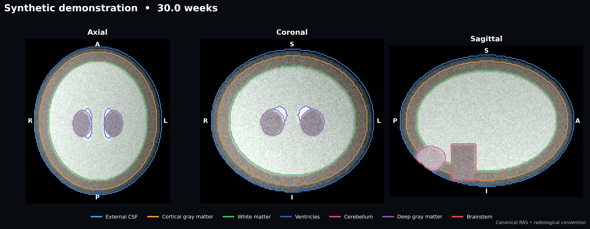
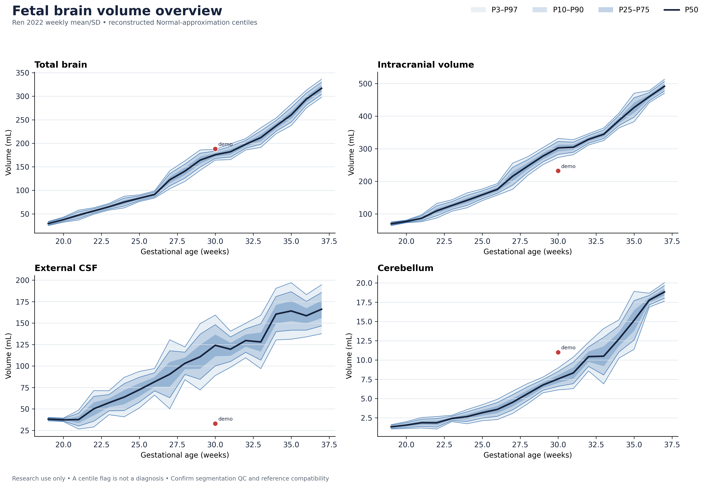

# Fetal Brain Growth

[](https://github.com/ajoshiusc/fetal-brain-growth/actions/workflows/tests.yml)
[](LICENSE)
[](#intended-use)

Standalone Python tools for fetal T2 MRI tissue segmentation, affine-aware
volumetry, transparent growth references, and presentation-quality radiology
figures. The package supports the public FetalSynthSeg model and FeTA labels,
but does not redistribute its checkpoint or any clinical/FeTA subject image.



## What is included

- a checksum-verified inference wrapper for the official FetalSynthSeg v1
  checkpoint;
- seven FeTA tissue volumes plus definition-aware literature aggregates;
- P3/P10/P25/P50/P75/P90/P97 charts from published weekly summary values;
- interpolated, quadratic, cubic, and cross-validated automatic table fitting;
- direct spline/quadratic/cubic quantile regression for a local
  FetalSynthSeg-matched control cohort;
- published coefficient-only mean models (Jarvis 2016 and Ren 2022 TBV);
- canonical RAS axial/coronal/sagittal panels in radiological convention;
- PNG, SVG, or PDF output through Matplotlib, with 300 dpi PNG defaults;
- a public-safe synthetic example and a meeting-ready Jupyter notebook.



## Install

Core analysis and plotting:

```bash
git clone https://github.com/ajoshiusc/fetal-brain-growth.git
cd fetal-brain-growth
python3 -m venv .venv
source .venv/bin/activate
python -m pip install --upgrade pip
python -m pip install -e '.[notebook,test]'
pytest
```

FetalSynthSeg is public source but **not public domain**. Its license is for
academic, non-commercial research. Read the upstream
[license](https://github.com/Medical-Image-Analysis-Laboratory/FetalSynthSeg/blob/main/LICENSE),
then let the installer pin the audited source commit, download the checkpoint,
and verify its SHA-256:

```bash
./scripts/install_fetalsynthseg.sh --accept-license
```

The installer keeps `models/` and `third_party/` out of Git. For PHI safety,
`data/`, DICOM, checkpoints, and common clinical-data directories are ignored.

## One case: segment, review, and measure

Input should be a skull-stripped/cropped 3-D T2w SVR reconstruction. FetalSynthSeg
preprocessing is reproduced at 0.5-mm isotropic resolution in canonical RAS.

```bash
fbg segment \
  --image /data/case001_svr.nii.gz \
  --checkpoint models/KISPI-all_fss.ckpt \
  --output outputs/case001_seg.nii.gz \
  --qc outputs/case001_segmentation_qc.png \
  --metadata outputs/case001_segmentation_provenance.json
```

Review the outline panel before using any volume. The figure resamples the
segmentation to the canonical-RAS MRI grid with nearest-neighbor interpolation,
selects the largest labeled cross-section in each plane, and labels orientation
explicitly. Patient right appears on image left in axial and coronal panels.

For a cohort, edit [`examples/manifest.csv`](examples/manifest.csv), then:

```bash
fbg measure --manifest examples/manifest.csv --output-dir outputs/cohort
```

NIfTI voxel volume is `abs(det(affine[0:3,0:3])) / 1000` mL; it is not inferred
from array dimensions or assumed isotropic.

## Reference option A: Ren 2022 weekly summaries

Build the conservative interpolated reference:

```bash
fbg build-reference \
  --method interpolate \
  --quantiles 0.03,0.10,0.25,0.50,0.75,0.90,0.97 \
  --output outputs/ren2022_curves.csv

fbg chart \
  --curves outputs/ren2022_curves.csv \
  --observations outputs/cohort/reference_compatible_volumes.csv \
  --scores outputs/cohort/reference_scores.csv \
  --regions total_brain,intracranial_volume,external_csf,cerebellum \
  --subtitle "Ren 2022 summary table; Normal-approximation centiles" \
  --output outputs/cohort/growth_chart.png
```

The weekly spreadsheet was transcribed from Ren et al. Table 1. Multiple
centiles are reconstructed as `mean(age) + Phi_inverse(q) × SD(age)`. This is
an explicit Normal approximation to published summary data—not a refit of
participant data. Full construction details, corrections, and label mappings
are in [`references/README.md`](references/README.md).

Smoothing options:

```bash
fbg build-reference --method quadratic --output outputs/ren_quadratic.csv
fbg build-reference --method cubic     --output outputs/ren_cubic.csv
fbg build-reference --method auto      --output outputs/ren_auto.csv
```

`auto` uses leave-one-week-out error for mean and log(SD), preferring quadratic
unless cubic improves the combined normalized score by more than 5%. The JSON
beside each CSV records the selected degree, coefficients, and validation error.

## Reference option B: fit the same segmentation pipeline

For individual FetalSynthSeg tissue trajectories, this is usually the better
method: process a reviewed normal control cohort using the same frozen model,
SVR pipeline, acquisition profile, and QC protocol, then directly fit quantiles.

```bash
fbg fit-reference \
  --volumes outputs/controls/tissue_volumes.csv \
  --method spline \
  --quantiles 0.03,0.10,0.25,0.50,0.75,0.90,0.97 \
  --output outputs/local_fetalsynthseg_reference.csv

fbg chart \
  --curves outputs/local_fetalsynthseg_reference.csv \
  --observations outputs/cases/tissue_volumes.csv \
  --matched-reference \
  --output outputs/local_fetalsynthseg_chart.svg
```

The default is cubic B-spline quantile regression in log-volume space.
`--method quadratic` and `--method cubic` directly fit those polynomial bases
when a model is pre-specified. Independent fitted quantiles are pointwise
ordered if they cross, and this count is recorded in metadata. Use one scan per
fetus; repeated observations need a longitudinal/mixed-effects model.

## Reference option C: published polynomial coefficients

```bash
fbg published --output outputs/published_tbv_models.png
```


Included equations are:

- Jarvis et al. 2016: `TBV = 89.69 − 13.33 GA + 0.53 GA²` (18–36 weeks);
- Ren et al. 2022: `TBV = 47.41 − 9.57 GA + 0.45 GA²` (19–37 weeks).

These are predicted **means only**. Coefficients alone do not define P3/P10/etc.,
so the software never adds invented bands. The prospective BMJ/ADC Fetal &
Neonatal study can be added when an authorized full coefficient/table source is
available; values are not reverse-engineered from a figure.

## Notebook

Open the executed [`notebooks/Radiology_Meeting_Demo.ipynb`](notebooks/Radiology_Meeting_Demo.ipynb)
or the standalone [`docs/Radiology_Meeting_Demo.html`](docs/Radiology_Meeting_Demo.html).
It generates a synthetic RAS phantom, displays the standard-orientation outline
panel, measures tissue/aggregate volumes, plots multiple centiles, and explains
the reference choices. Replace its paths only with locally approved images;
do not commit meeting outputs containing patient data.

## Outputs for radiology review

- Use `.png` for slides (default 300 dpi), `.svg` for editable vector charts,
  and `.pdf` for print/vector archiving.
- Contours preserve T2 anatomy better than opaque label fills; `--fill-alpha`
  adds a subtle fill when desired.
- Flagged points are red, within-interval points green, and definition-mismatch
  comparisons amber.
- Only TBV, ICV, external CSF, and cerebellum are automatically status-flagged
  against Ren because their definitions are reasonably aligned. Other regions
  remain visible but are marked comparison-only.

## Intended use

This is research software, not a medical device. “Outside P3–P97” is a
reference flag, not an abnormality diagnosis. Gestational-age uncertainty,
population sampling, MRI acquisition, SVR reconstruction, model/domain shift,
segmentation error, and label-definition mismatch all affect interpretation.
Every case requires expert visual QC and fetal neuroradiology review; any
clinical use requires local governance and independent validation.

## References

- Ren J-Y et al. *Front Neurosci.* 2022;16:886083.
  [doi:10.3389/fnins.2022.886083](https://doi.org/10.3389/fnins.2022.886083)
- Jarvis D et al. *Prenat Diagn.* 2016;36:1225–1232.
  [doi:10.1002/pd.4961](https://doi.org/10.1002/pd.4961)
- Zalevskyi V et al. *MICCAI.* 2024; LNCS 15001:437–447 (FetalSynthSeg).
  [doi:10.1007/978-3-031-72378-0_41](https://doi.org/10.1007/978-3-031-72378-0_41)

Code in this repository is MIT licensed. The upstream FetalSynthSeg source and
checkpoint remain governed by their own license.
